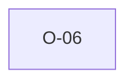

# O-06 — Rule 19 spec prose is looser than the AGS dictionary

> Source-of-truth: `repo:OBSERVATIONS.md#o-6`.
> This page links + cross-references only — it never copies the 5 fields.

## Summary
> [!spec] **SPEC.** Rule 19 prose permits ≤4 'letters AND numbers'; python (and we) enforce the de-facto 'exactly 4 uppercase letters' the dictionary universally follows (0/319 deviate). Prose ⇄ dictionary disagree.

Source-of-truth (never pasted): `repo:OBSERVATIONS.md#o-6`.

## Rules affected
[[rule-19-group-name-format]]

## Cross-observation graph

## Upstream status
> [!note] Upstream-reportable: [SPEC] — AGS-DFWG should tighten Rule 19 wording to 'exactly 4 uppercase letters'.

_Not yet marked Reported in OBSERVATIONS.md._

## Related
[[parity-model]] · [[upstream-reporting]]
