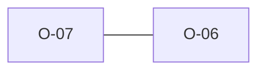

# O-07 — Rule 19b_1's field-length limit isn't in the prose (but the dict obeys it)

> Source-of-truth: `repo:OBSERVATIONS.md#o-7`.
> This page links + cross-references only — it never copies the 5 fields.

## Summary
> [!spec] **SPEC.** Rule 19b_1's ≤4-char field-part limit is in no prose but the dictionary obeys it (0/4199 deviate). Same prose-vs-de-facto pattern as O-6.

Source-of-truth (never pasted): `repo:OBSERVATIONS.md#o-7`.

## Rules affected
[[rule-19-group-name-format]]

## Cross-observation graph

## Upstream status
> [!note] Upstream-reportable: [SPEC] — state the field-part ≤4 convention explicitly.

_Not yet marked Reported in OBSERVATIONS.md._

## Related
[[parity-model]] · [[upstream-reporting]] · [[O-06]]
