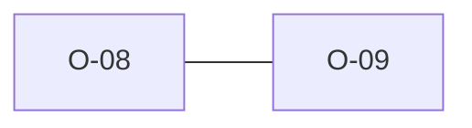

# O-08 — python-ags4 rule_7_2 can raise IndexError on duplicate headings

> Source-of-truth: `repo:OBSERVATIONS.md#o-8`.
> This page links + cross-references only — it never copies the 5 fields.

## Summary
> [!bug] **BUG.** python rule_7_2 can raise IndexError on duplicate headings (unbounded temp[i]) and abort the whole run. We bounds-guard and let the duplicate be the actionable finding.

Source-of-truth (never pasted): `repo:OBSERVATIONS.md#o-8`.

## Rules affected
[[rule-07-heading-order]]

## Cross-observation graph

## Upstream status
> [!note] Upstream-reportable: [BUG] — rule_7_2 should bound-check temp[i].

_Not yet marked Reported in OBSERVATIONS.md._

## Related
[[parity-model]] · [[upstream-reporting]] · [[O-09]]
