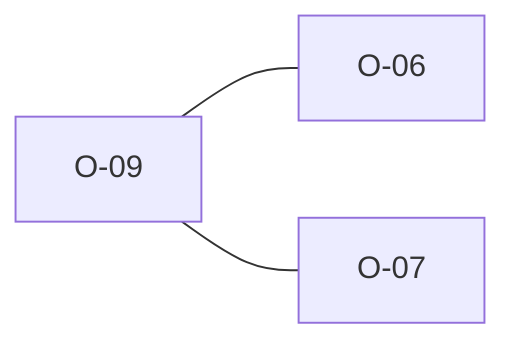

# O-09 — Rule 7's "no duplicate headings" is inferred, not in the prose

> Source-of-truth: `repo:OBSERVATIONS.md#o-9`.
> This page links + cross-references only — it never copies the 5 fields.

## Summary
> [!note] **NOTE.** Rule 7's 'no duplicate headings' is inferred (implied by Rules 4/7/8 together), not literal prose. We keep the check.

Source-of-truth (never pasted): `repo:OBSERVATIONS.md#o-9`.

## Rules affected
[[rule-07-heading-order]]

## Cross-observation graph

## Upstream status
> [!note] Upstream-reportable: [NOTE] — AGS-DFWG could make no-duplicate-HEADING explicit.

_Not yet marked Reported in OBSERVATIONS.md._

## Related
[[parity-model]] · [[upstream-reporting]] · [[O-06]] · [[O-07]]
