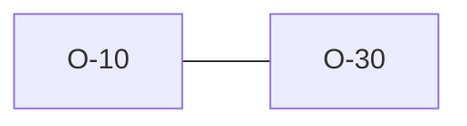

# O-10 — Dictionary version: explicit option, not TRAN_AGS-derived

> Source-of-truth: `repo:observations.json` (record O-10), rendered at `repo:OBSERVATIONS.md#o-10`.
> This page links + cross-references only — it never copies the 5 fields.

## Summary
> [!variance] **VARIANCE.** Original scope boundary: explicit --dict-version vs python's TRAN_AGS auto-select. RESOLVED post-V8 by O-30 (all 5 editions bundled, TRAN_AGS auto-select default).

Source-of-truth (never pasted): `repo:observations.json`, record O-10 — rendered at `repo:OBSERVATIONS.md#o-10`.

## Rules affected
[[rule-14-tran-group]]

## Cross-observation graph

## Upstream status
Not upstream-reportable — — superseded by O-30..

## Related
[[parity-model]] · [[upstream-reporting]] · [[O-30]]
