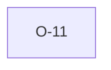

# O-11 — python-ags4 folds ID-uniqueness into Rule 8 (it's Rule 10a's job)

> Source-of-truth: `repo:OBSERVATIONS.md#o-11`.
> This page links + cross-references only — it never copies the 5 fields.

## Summary
> [!spec] **SPEC.** python folds group-ID uniqueness into Rule 8 (it's Rule 10a's job); a dup group ID is double-reported under both. We mirror the attribution for count parity, re-detect under 10a.

Source-of-truth (never pasted): `repo:OBSERVATIONS.md#o-11`.

## Rules affected
[[rule-08-typed-values]] · [[rule-10a-key-uniqueness]]

## Cross-observation graph

## Upstream status
> [!note] Upstream-reportable: [SPEC] — move ID-uniqueness wholly under Rule 10a.

_Not yet marked Reported in OBSERVATIONS.md._

## Related
[[parity-model]] · [[upstream-reporting]]
