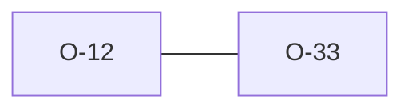

# O-12 — DT/T validity engine differs from pandas

> Source-of-truth: `repo:observations.json` (record O-12), rendered at `repo:OBSERVATIONS.md#o-12`.
> This page links + cross-references only — it never copies the 5 fields.

## Summary
> [!variance] **VARIANCE.** DT/T validity engine: python uses pandas.to_datetime, we use chrono Naive*. Equivalent for every dictionary UNIT; divergence only on non-standard UNIT shapes (we are structural-only + lenient). O-33 later corrected the value-range scope.

Source-of-truth (never pasted): `repo:observations.json`, record O-12 — rendered at `repo:OBSERVATIONS.md#o-12`.

## Rules affected
[[rule-08-typed-values]]

## Cross-observation graph

## Upstream status
Not upstream-reportable — — implementation choice..

## Related
[[parity-model]] · [[upstream-reporting]] · [[O-33]]
