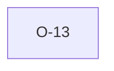

# O-13 — TYPE classification: exact vs python's substring test

> Source-of-truth: `repo:observations.json` (record O-13), rendered at `repo:OBSERVATIONS.md#o-13`.
> This page links + cross-references only — it never copies the 5 fields.

## Summary
> [!note] **NOTE.** TYPE classification: python uses loose substring ('DP' in t), we use exact prefix+suffix. Equivalent on valid codes; we're strictly more robust to malformed codes.

Source-of-truth (never pasted): `repo:observations.json`, record O-13 — rendered at `repo:OBSERVATIONS.md#o-13`.

## Rules affected
[[rule-08-typed-values]]

## Cross-observation graph

## Upstream status
> [!note] Upstream-reportable: [NOTE] — minor; python's dispatch is fragile but never misfires on real dicts.

_Not yet marked Reported in OBSERVATIONS.md._

## Related
[[parity-model]] · [[upstream-reporting]]
