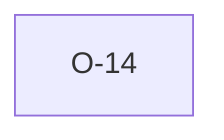

# O-14 — nSF parity is behavioural, not source-derived (clean-room)

> Source-of-truth: `repo:OBSERVATIONS.md#o-14`.
> This page links + cross-references only — it never copies the 5 fields.

## Summary
> [!note] **NOTE.** nSF parity is behavioural (fitted to python validator OUTPUT via the MIT ags5db formatter), not source-translated — the clean-room boundary held.

Source-of-truth (never pasted): `repo:OBSERVATIONS.md#o-14`.

## Rules affected
[[rule-08-typed-values]]

## Cross-observation graph

## Upstream status
Not upstream-reportable — implementation/scope choice.

## Related
[[parity-model]] · [[upstream-reporting]]
