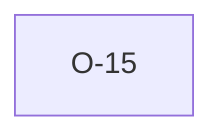

# O-15 — Rule 12 is a no-op (wholly subsumed by Rule 10b)

> Source-of-truth: `repo:OBSERVATIONS.md#o-15`.
> This page links + cross-references only — it never copies the 5 fields.

## Summary
> [!note] **NOTE.** Rule 12 is a no-op (definition + pointer to Rule 10b's REQUIRED-fill); python's rule_12 is a bare return. Substantive check lands in 10b.

Source-of-truth (never pasted): `repo:OBSERVATIONS.md#o-15`.

## Rules affected
[[rule-12-data-optionality]] · [[rule-10a-key-uniqueness]]

## Cross-observation graph

## Upstream status
Not upstream-reportable — implementation/scope choice.

## Related
[[parity-model]] · [[upstream-reporting]]
