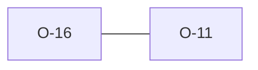

# O-16 — Rules 13/14 double-report a zero-row PROJ/TRAN with Rule 2

> Source-of-truth: `repo:observations.json` (record O-16), rendered at `repo:OBSERVATIONS.md#o-16`.
> This page links + cross-references only — it never copies the 5 fields.

## Summary
> [!note] **NOTE.** A zero-row PROJ/TRAN is double-reported by Rule 2 (general) and Rule 13/14 (PROJ/TRAN cardinality); python does the same. Kept for count parity.

Source-of-truth (never pasted): `repo:observations.json`, record O-16 — rendered at `repo:OBSERVATIONS.md#o-16`.

## Rules affected
[[rule-02-group-has-data]] · [[rule-13-proj-group]] · [[rule-14-tran-group]]

## Cross-observation graph

## Upstream status
> [!note] Upstream-reportable: [NOTE] — duplication is in the standard's structure, not a defect.

_Not yet marked Reported in OBSERVATIONS.md._

## Related
[[parity-model]] · [[upstream-reporting]] · [[O-11]]
