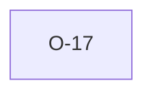

# O-17 — Rule 18 keys off heading membership only, not GROUP names

> Source-of-truth: `repo:observations.json` (record O-17), rendered at `repo:OBSERVATIONS.md#o-17`.
> This page links + cross-references only — it never copies the 5 fields.

## Summary
> [!spec] **SPEC.** Rule 18 prose names 'GROUP and HEADING' but nothing keys off non-standard GROUP names — python's rule_18 only fires off Rule 9's heading findings. Narrow but real under-enforcement.

Source-of-truth (never pasted): `repo:observations.json`, record O-17 — rendered at `repo:OBSERVATIONS.md#o-17`.

## Rules affected
[[rule-18-dict-group]] · [[rule-09-unknown-headings]]

## Cross-observation graph

## Upstream status
> [!note] Upstream-reportable: [SPEC] — make non-standard GROUP-name detection explicit.

_Not yet marked Reported in OBSERVATIONS.md._

## Related
[[parity-model]] · [[upstream-reporting]]
