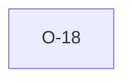

# O-18 — Rule 18a has no dedicated check

> Source-of-truth: `repo:OBSERVATIONS.md#o-18`.
> This page links + cross-references only — it never copies the 5 fields.

## Summary
> [!note] **NOTE.** Rule 18a has no dedicated check; its DICT-order semantic is enforced indirectly by Rule 7 (order) and Rule 11 (Record Link sequence). A standalone check would be redundant.

Source-of-truth (never pasted): `repo:OBSERVATIONS.md#o-18`.

## Rules affected
[[rule-18-dict-group]] · [[rule-07-heading-order]] · [[rule-11a-tran-dlim]]

## Cross-observation graph

## Upstream status
Not upstream-reportable — implementation/scope choice.

## Related
[[parity-model]] · [[upstream-reporting]]
