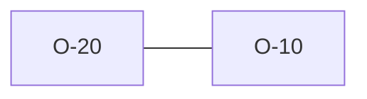

# O-20 — No AGS rule enforces TRAN_AGS == dictionary edition

> Source-of-truth: `repo:observations.json` (record O-20), rendered at `repo:OBSERVATIONS.md#o-20`.
> This page links + cross-references only — it never copies the 5 fields.

## Summary
> [!variance] **VARIANCE.** Clarifies O-10: there is NO rule enforcing TRAN_AGS == dictionary edition (rule_14 only checks TRAN presence + single row); TRAN_AGS only selects the dictionary. O-10's 'Rule 14/V6' expectation was inaccurate.

Source-of-truth (never pasted): `repo:observations.json`, record O-20 — rendered at `repo:OBSERVATIONS.md#o-20`.

## Rules affected
[[rule-14-tran-group]]

## Cross-observation graph

## Upstream status
Not upstream-reportable — — supersedes the O-10 forward-reference..

## Related
[[parity-model]] · [[upstream-reporting]] · [[O-10]]
