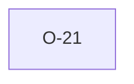

# O-21 — Rule 10c's parentless-group list is hardcoded, not dict-derived

> Source-of-truth: `repo:OBSERVATIONS.md#o-21`.
> This page links + cross-references only — it never copies the 5 fields.

## Summary
> [!spec] **SPEC.** Rule 10c's parentless set is HARDCODED (PROJ,TRAN,ABBR,DICT,UNIT,TYPE,LOCA,FILE,LBSG,PREM,STND — 11, incl. LOCA) not DICT_PGRP-derived: LOCA's DICT_PGRP is PROJ yet LOCA rows carry no PROJ key, so a dict-derived check would emit bogus orphans. Maintenance hazard. (Spec §3.1 lists only 10 non-hierarchy groups — see [[non-hierarchy-ten-vs-parentless-list]].)

Source-of-truth (never pasted): `repo:OBSERVATIONS.md#o-21`.

## Rules affected
[[rule-10a-key-uniqueness]]

## Cross-observation graph

## Upstream status
> [!note] Upstream-reportable: [SPEC] — make parentless/implicit-link a dictionary property so Rule 10c is data-driven.

_Not yet marked Reported in OBSERVATIONS.md._

## Related
[[parity-model]] · [[upstream-reporting]]
