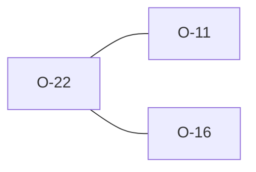

# O-22 — Rules 10a/10b/10c double-report against Rules 8/13/14

> Source-of-truth: `repo:observations.json` (record O-22), rendered at `repo:OBSERVATIONS.md#o-22`.
> This page links + cross-references only — it never copies the 5 fields.

## Summary
> [!note] **NOTE.** Rules 10a/10b/10c double-report against Rules 8/13/14 (e.g. non-unique ID under 8 (O-11) and 10a). Deliberate spec layering; same family as O-11/O-16. Kept for count parity.

Source-of-truth (never pasted): `repo:observations.json`, record O-22 — rendered at `repo:OBSERVATIONS.md#o-22`.

## Rules affected
[[rule-08-typed-values]] · [[rule-10a-key-uniqueness]] · [[rule-13-proj-group]] · [[rule-14-tran-group]]

## Cross-observation graph

## Upstream status
> [!note] Upstream-reportable: [NOTE] — consolidation candidate, not a defect.

_Not yet marked Reported in OBSERVATIONS.md._

## Related
[[parity-model]] · [[upstream-reporting]] · [[O-11]] · [[O-16]]
