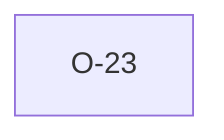

# O-23 — Rule 11a/11b: absent TRAN_DLIM/RCON *column* is silently OK

> Source-of-truth: `repo:observations.json` (record O-23), rendered at `repo:OBSERVATIONS.md#o-23`.
> This page links + cross-references only — it never copies the 5 fields.

## Summary
> [!note] **NOTE.** python rule_11: an ABSENT TRAN_DLIM/RCON column → KeyError → swallowed → no 11a/11b finding (they're OTHER, not REQUIRED). Empty value does fire 11a/11b. We mirror this; a file using RL but omitting the columns gets no 11a/11b (bad links surface under 11c).

Source-of-truth (never pasted): `repo:observations.json`, record O-23 — rendered at `repo:OBSERVATIONS.md#o-23`.

## Rules affected
[[rule-11a-tran-dlim]]

## Cross-observation graph

## Upstream status
> [!note] Upstream-reportable: [NOTE] — arguably 11a/11b should fire when an RL column exists but DLIM/RCON don't.

_Not yet marked Reported in OBSERVATIONS.md._

## Related
[[parity-model]] · [[upstream-reporting]]
