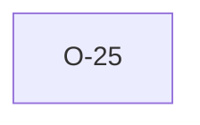

# O-25 — Effective dict for status/parent built independently of V4

> Source-of-truth: `repo:observations.json` (record O-25), rendered at `repo:OBSERVATIONS.md#o-25`.
> This page links + cross-references only — it never copies the 5 fields.

## Summary
> [!variance] **VARIANCE.** V7 builds its own richer EffectiveDict (status/parent) independently of V4's heading-name DICT consumer — deliberate 'duplicate now, refactor later'. Consolidation flagged for V8.

Source-of-truth (never pasted): `repo:observations.json`, record O-25 — rendered at `repo:OBSERVATIONS.md#o-25`.

## Rules affected
[[rule-07-heading-order]] · [[rule-09-unknown-headings]] · [[rule-10a-key-uniqueness]]

## Cross-observation graph

## Upstream status
Not upstream-reportable — — internal structure..

## Related
[[parity-model]] · [[upstream-reporting]]
