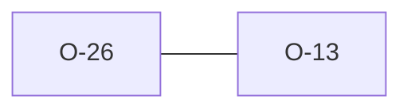

# O-26 — 19b_2/19b_3 re-report headings already flagged by 19b_1/9

> Source-of-truth: `repo:OBSERVATIONS.md#o-26`.
> This page links + cross-references only — it never copies the 5 fields.

## Summary
> [!note] **NOTE.** python rule_19b_2/19b_3 re-report a malformed heading already flagged by 19b_1 + Rule 9 — up to 3× under 19b plus 1× under 9. We gate 19b_2/3 to the genuine borrowed-heading case only; presence parity holds.

Source-of-truth (never pasted): `repo:OBSERVATIONS.md#o-26`.

## Rules affected
[[rule-19-group-name-format]]

## Cross-observation graph

## Upstream status
> [!note] Upstream-reportable: [NOTE] — python could gate 19b_2/3 on 'prefix≠group & has underscore'.

_Not yet marked Reported in OBSERVATIONS.md._

## Related
[[parity-model]] · [[upstream-reporting]] · [[O-13]]
