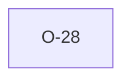

# O-28 — External `--dict` custom-dictionary override — deferred at V8, implemented in #568

> Source-of-truth: `repo:observations.json` (record O-28), rendered at `repo:OBSERVATIONS.md#o-28`.
> This page links + cross-references only — it never copies the 5 fields.

## Summary
> [!variance] **VARIANCE — now IMPLEMENTED.** The V8 roadmap listed a runtime
> `--dict <path>` override, then deferred it (`Dictionary` was `'static`
> phf-backed; a runtime-parsed dict looked like a broad, regression-prone
> lifetime refactor for a feature validation didn't need) — for a period the
> flag was plumbed but refused with a `BadDict` error. **#568** shipped it
> across all four surfaces (CLI `--dict`/`--dict-replace`, Python/Node
> `dict_path`/`dict_bytes`/`dict_replace`, wasm bytes-only): `Dictionary`
> became a lifetime-parametric enum (`Bundled` vs `Layered { base, delta }`,
> still `Copy`) overlaying a sparse `OwnedDelta` on a bundled base edition —
> the base is **detected as a property of the dictionary itself** (structural,
> defaulting to the latest edition when purely additive), fixed before any
> delivery byte is read. Input is `.ags` or JSON, auto-sniffed. A re-parented
> or overridden STANDARD heading is honour + warn, never a silent shadow. The
> `.ags.idx` certificate **records** the effective dictionary's `{name, hash}`
> — a record, not a contract ([[O-48]]): a later `validate --index` against a
> different dictionary re-validates (`revalidate_reason = dictionary_changed`),
> it never silently vouches. See [[dec-custom-dict-overlay]] for the full
> design.

Source-of-truth (never pasted): `repo:observations.json`, record O-28 — rendered at `repo:OBSERVATIONS.md#o-28`.

## Rules affected
_none (process/scope observation)_

## Cross-observation graph

## Upstream status
Not upstream-reportable — implementation capability, not a spec divergence.

## Related
[[parity-model]] · [[upstream-reporting]] · [[dec-custom-dict-overlay]] · [[cert-trust-v2]]
