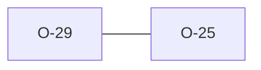

# O-29 — EffectiveDict consolidation (O-25) deliberately not done

> Source-of-truth: `repo:observations.json` (record O-29), rendered at `repo:OBSERVATIONS.md#o-29`.
> This page links + cross-references only — it never copies the 5 fields.

## Summary
> [!note] **NOTE.** EffectiveDict consolidation (O-25) deliberately NOT done at V8 — smallest safe move only (shared collect_file_dict); a full 3-consumer merge would churn 5 green rule families for tidiness. Accepted tech debt.

Source-of-truth (never pasted): `repo:observations.json`, record O-29 — rendered at `repo:OBSERVATIONS.md#o-29`.

## Rules affected
[[rule-07-heading-order]] · [[rule-09-unknown-headings]] · [[rule-10a-key-uniqueness]]

## Cross-observation graph

## Upstream status
Not upstream-reportable — — accepted internal tech debt..

## Related
[[parity-model]] · [[upstream-reporting]] · [[O-25]]
