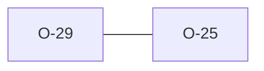

# O-29 — EffectiveDict consolidation (O-25) — deferred at V8, done in #777

> Source-of-truth: `repo:observations.json` (record O-29), rendered at `repo:OBSERVATIONS.md#o-29`.
> This page links + cross-references only — it never copies the 5 fields.

## Summary
> [!note] **NOTE — now IMPLEMENTED.** At V8 the consolidation was deliberately
> NOT done — smallest safe move only (shared `collect_file_dict`); a full
> 3-consumer merge would have churned 5 green rule families for tidiness.
> **#777** paid the debt when a read-only consumer needed the union too, with
> the `DICT_DTYP`/`DICT_UNIT` columns neither private copy read: the one shared
> module now lives in `laterite-ags4-reference` (see [[effective-dictionary]]),
> feeds the Rule 7/9, 10a–c and 19b families, and is re-exported by
> `laterite-ags4-core` for readers. Parity with python-ags4 held by identity
> across the rewire.

Source-of-truth (never pasted): `repo:observations.json`, record O-29 — rendered at `repo:OBSERVATIONS.md#o-29`.

## Rules affected
[[rule-07-heading-order]] · [[rule-09-unknown-headings]] · [[rule-10a-key-uniqueness]]

## Cross-observation graph

## Upstream status
Not upstream-reportable — internal structure.

## Related
[[parity-model]] · [[upstream-reporting]] · [[O-25]]
