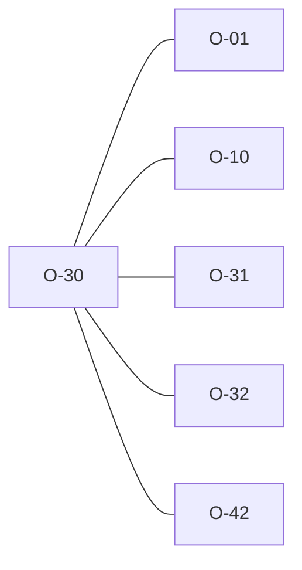

# O-30 — TRAN_AGS-driven edition selection — deliberate divergences from python

> Source-of-truth: `repo:OBSERVATIONS.md#o-30`.
> This page links + cross-references only — it never copies the 5 fields.

## Summary
> [!variance] **VARIANCE.** TRAN_AGS-driven edition auto-select (resolves O-10). Deliberate divergences from python: bare 4.0→4.0.4 (newest patch, python→oldest 4.0.3); AGS3→hard UnsupportedEdition (python silently →4.1.1); bare '4'→4.0-line (41% of a 12.5k corpus; python→4.1.1). Parity folds AGS3 refusal into KNOWN_DIVERGENCE so 57 expected divergences leave the ACTION list.

Source-of-truth (never pasted): `repo:OBSERVATIONS.md#o-30`.

## Rules affected
[[rule-14-tran-group]]

## Cross-observation graph

## Upstream status
> [!note] Upstream-reportable: [VARIANCE] — mapping bare '4.0'→oldest patch is surprising; newest-patch safer.

_Not yet marked Reported in OBSERVATIONS.md._

## Related
[[parity-model]] · [[upstream-reporting]] · [[O-01]] · [[O-10]] · [[O-31]] · [[O-32]]
