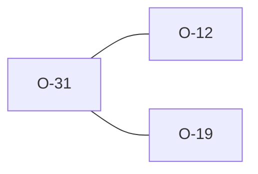

# O-31 — Rule 8 — empty `DT` UNIT now flagged (python parity; closes the O-12 degenerate gap)

> Source-of-truth: `repo:OBSERVATIONS.md#o-31`.
> This page links + cross-references only — it never copies the 5 fields.

## Summary
> [!variance] **VARIANCE.** Rule 8: an EMPTY DT UNIT — python builds an empty regex, ''.fullmatch(value) is False → flags Rule 8; we used to stay clean (false negative). Now structural_dt_match returns value.is_empty() for empty UNIT → matches python. DT only.

Source-of-truth (never pasted): `repo:OBSERVATIONS.md#o-31`.

## Rules affected
[[rule-08-typed-values]]

## Cross-observation graph

## Upstream status
> [!note] Upstream-reportable: [VARIANCE] — python's 'format ()' text is awkward but flagging a no-declared-format value is defensible; empty DT UNIT is a producer-side defect.

_Not yet marked Reported in OBSERVATIONS.md._

## Related
[[parity-model]] · [[upstream-reporting]] · [[O-12]] · [[O-19]]
