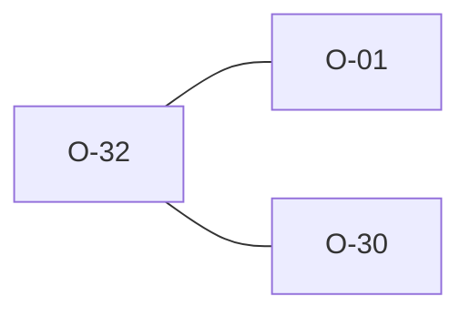

# O-32 — Non-UTF-8 input is decoded lossily, not refused (mirrors python's `errors="replace"`; closes the `NotUtf8` black hole)

> Source-of-truth: `repo:OBSERVATIONS.md#o-32`.
> This page links + cross-references only — it never copies the 5 fields.

## Summary
> [!variance] **VARIANCE.** Non-UTF-8 input: we hard-failed NotUtf8 (zero rules — a black hole, worse than python). python opens utf-8 errors='replace' → U+FFFD → Rule 1. Now parse_file uses from_utf8_lossy (exact twin); the 12 cp1252 files AGREE on a Rule 1 error. Wrapper cleanup-only, no masking.

Source-of-truth (never pasted): `repo:OBSERVATIONS.md#o-32`.

## Rules affected
[[rule-01-ascii]]

## Cross-observation graph

## Upstream status
> [!note] Upstream-reportable: [VARIANCE] — python's errors='replace'→U+FFFD erases the original byte (two cp1252 files can collide on identical Rule 1 output); is_ags_ascii admits 128–255 vs strict ASCII (cf O-1).

_Not yet marked Reported in OBSERVATIONS.md._

## Related
[[parity-model]] · [[upstream-reporting]] · [[O-01]] · [[O-30]]
