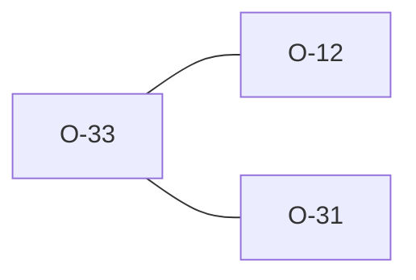

# O-33 — Rule 8 — DT/datetime bounded to pandas' Timestamp range (closes the value-range gap O-12 missed)

> Source-of-truth: `repo:observations.json` (record O-33), rendered at `repo:OBSERVATIONS.md#o-33`.
> This page links + cross-references only — it never copies the 5 fields.

## Summary
> [!variance] **VARIANCE.** Rule 8: chrono accepts any year; python's pd.to_datetime NaTs dates outside pandas' Timestamp range (1677-09-21..2262-04-11). A corrupt 0018-06-03 passed Rust, flagged python. Now dt_semantic_ok bounds date/datetime to the pandas range → AGREE. Corrects O-12's value-range scope.

Source-of-truth (never pasted): `repo:observations.json`, record O-33 — rendered at `repo:OBSERVATIONS.md#o-33`.

## Rules affected
[[rule-08-typed-values]]

## Cross-observation graph

## Upstream status
> [!note] Upstream-reportable: [VARIANCE] — pandas' range is an implementation artifact, not an AGS requirement; python silently rejects spec-valid pre-1678/post-2262 dates.

_Not yet marked Reported in OBSERVATIONS.md._

## Related
[[parity-model]] · [[upstream-reporting]] · [[O-12]] · [[O-31]]
