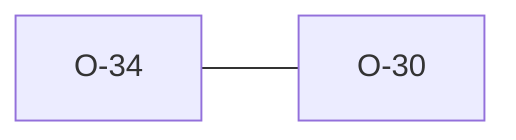

# O-34 — `NotAgs4` ↔ python "missing mandatory groups" is a KNOWN_DIVERGENCE

> Source-of-truth: `repo:OBSERVATIONS.md#o-34`.
> This page links + cross-references only — it never copies the 5 fields.

## Summary
> [!variance] **VARIANCE.** Tab-delimited/empty 'AGS' files: Rust returns NotAgs4 (correct — no spec-valid quoted GROUP rows); python has no refuse path so it mislabels them 'missing PROJ/TRAN/TYPE/UNIT' (Rule 13/14/15/17). parity.rs classify maps NotAgs4 + all-mandatory-absent → KNOWN_DIVERGENCE O-34 (exact O-30 shape one level up).

Source-of-truth (never pasted): `repo:OBSERVATIONS.md#o-34`.

## Rules affected
[[rule-13-proj-group]] · [[rule-14-tran-group]] · [[rule-17-type-group]]

## Cross-observation graph

## Upstream status
> [!note] Upstream-reportable: [VARIANCE] — python should detect non-CSV/empty input and refuse like it (eventually) does for AGS3.

_Not yet marked Reported in OBSERVATIONS.md._

## Related
[[parity-model]] · [[upstream-reporting]] · [[O-30]]
