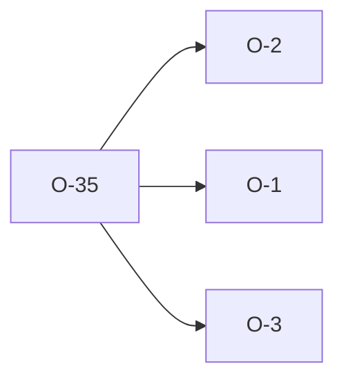

# O-35 — presence-only reconcile can't whittle a python parse-layer cascade

> Source-of-truth: `repo:observations.json` (record O-35), rendered at `repo:OBSERVATIONS.md#o-35`.
> This page links + cross-references only — it never copies the 5 fields.

## Summary
> [!note] **NOTE.** python's parsing layer fans one malformed construct into a *set* of rules (embedded CR → 2a/3/5; valid-extended → ∅; unquoted → 3) where Rust emits one. `reconcile` matches single documented rule-swaps only, so a cascade leaves residue → a known root cause becomes a false ACTION. Fix is **signature-narrow** arms, never generic widening.

Source-of-truth (never pasted): `repo:observations.json`, record O-35 — rendered at `repo:OBSERVATIONS.md#o-35`.

## Rules affected
[[rule-01-ascii]] · [[rule-06-comma-no-embedded-crlf]] · [[rule-05-quoting]]

## Cross-observation graph

## Upstream status
Not upstream-reportable — parity harness / methodology.

## Related
[[parity-model]] · [[parity-cascade-unreconcilable]] · [[O-02]] · [[O-01]] · [[O-03]]
