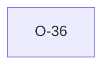

# O-36 — parity differential is triage-biased by default

> Source-of-truth: `repo:OBSERVATIONS.md#o-36`.
> This page links + cross-references only — it never copies the 5 fields.

## Summary
> [!note] **NOTE.** The parity set is `triage ∪ reservoir(rest, --parity-sample)` with `--parity-sample` defaulting to 0, so by default only files Rust already flagged odd are oracle-checked; a confidently-but-wrongly-handled file never reaches python. "Corpus mostly AGREEs" says nothing about rules with zero differential evidence. Follow-ups: non-zero default sample + a per-rule zero-evidence report (the `parity_matrix_dogfood` is the first instalment).

Source-of-truth (never pasted): `repo:OBSERVATIONS.md#o-36`.

> [!note] The "non-zero default sample" follow-up is generalised by the
> adaptive [[parity-confidence-model]] in [[ags4-forge]]: a per-class
> trust ledger decays oracle sampling to a never-zero floor instead of
> a flat rate.

## Rules affected
Harness-wide (no single rule) — see [[parity-model]].

## Cross-observation graph

## Upstream status
Not upstream-reportable — parity harness / methodology.

## Related
[[parity-model]] · [[parity-triage-sampling-bias]] · [[strat-parity-matrix]] · [[parity-confidence-model]]
