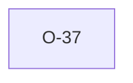

# O-37 — native parser is lenient where python-ags4 raises hard

> Source-of-truth: `repo:OBSERVATIONS.md#o-37`.
> This page links + cross-references only — it never copies the 5 fields.

## Summary
> [!note] **VARIANCE.** python-ags4 raises `AGS4Error` on duplicate `GROUP` lines, ragged DATA rows, and (when `rename_duplicate_headers=False`) duplicate headings — the read fails. The native laterite parser is deliberately lenient: it returns *something* the validator can then catalogue via Findings. Opposite design philosophies, both internally coherent. Native lenience preserved; `laterite.compat` interposes a `_strict_pre_check` pass that mirrors python-ags4's raises for the python-ags4 drop-in surface.

Source-of-truth (never pasted): `repo:OBSERVATIONS.md#o-37`.

## Rules affected
Parser-layer; no single rule. Relates conceptually to Rules 4 (field-count), 7 (duplicate headings), and the implicit "one GROUP row per group" contract.

## Cross-observation graph

## Upstream status
Not upstream-reportable — design choice, not a bug.

## Related
[[parity-model]] · [[oracle-drift-pin]]
