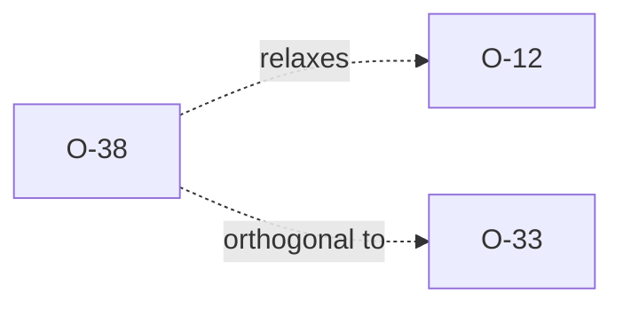

# O-38 — python-ags4 Rule 8 DT forbids non-ISO UNITs

> Source-of-truth: `repo:OBSERVATIONS.md#o-38`.
> This page links + cross-references only — it never copies the 5 fields.

## Summary
> [!divergence] **SPEC.** python-ags4's `rule_8` DT branch hard-codes `pd.to_datetime(value, format='ISO8601')` for every non-time UNIT. A legitimate spec-conformant value like `01/12/2020` under UNIT `dd/mm/yyyy` is structurally fine but mask1 always fails (not ISO-8601), so python-ags4 flags it. Effect: any non-ISO UNIT (`dd/mm/yyyy`, `dd-mm-yyyy`, `dd.mm.yyyy`, `mm/dd/yyyy`, `mm-dd-yyyy`, `dd/mm/yy`, `mm-yyyy`, `mm/yyyy`) is un-validatable. Laterite now translates the UNIT pattern into a real format and parses against it, making it spec-correct.

Source-of-truth (never pasted): `repo:OBSERVATIONS.md#o-38`.

## Evidence

`ags-wiki/.bootstrap/probes/probe_dt_formats.py` — 45-case matrix at
`dt-formats-matrix.md`. After laterite's Stage-8 fix: 34/45 AGREE (was
27/45). The remaining 11 PY_ONLY divergences are **all** "python-ags4
wrongly flags a valid value" of this exact shape:

```
| PY_ONLY | `dd/mm/yyyy` | `01/12/2020` | ok | ok | flags |
| PY_ONLY | `mm/dd/yyyy` | `12/01/2020` | ok | ok | flags |
| PY_ONLY | `mm-yyyy`    | `12-2020`    | ok | ok | flags |
…
```

## Rules affected
[[rule-08-typed-values]] — DT branch only.

## Cross-observation graph



[[O-12]] previously left laterite lenient on unrecognised UNIT
shapes (silently accepted everything). O-38 narrows O-12: the lex
now validates any UNIT in the `y/m/d/h/s/+/literal` grammar; only
shapes outside that grammar still fall back to lenient. [[O-33]]
(pandas Timestamp range bound) still applies on top.

## Upstream status
**Open candidate** for an AGS-DFWG / python-ags4 issue. The fix is
small (translate UNIT pattern → `pd.to_datetime` format string)
and affects every European/US delivery using non-ISO date formats.

## Related
[[rule-08-typed-values]] · [[O-12]] · [[O-33]] · [[parity-model]] · [[oracle-drift-pin]]
