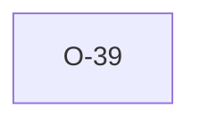

# O-39 — Rule 10c, empty parent KEYs are not entries

> Source-of-truth: `repo:observations.json` (record O-39), rendered at `repo:OBSERVATIONS.md#o-39`.

## Summary
> [!divergence] **SPEC.** Rule 10c says *"every entry made in the KEY fields must have an equivalent entry in its PARENT GROUP."* The text is ambiguous on whether an *empty* KEY cell counts as "an entry". python-ags4 reads it permissively (empty = no entry = no parent claim, skip the row). Laterite previously read it strictly (every row's KEY cell is an entry; empty = unlinked = flag). Geotech workflows produce legitimately standalone rows (lab controls, off-site samples), so python-ags4's reading is the better UX. Aligned in Stage 9b.

Source-of-truth (never pasted): `repo:observations.json`, record O-39 — rendered at `repo:OBSERVATIONS.md#o-39`.

## Rules affected
[[rule-10c-parent-child]] — only when the child row's parent-KEY tuple is *all* empty. A row with any non-empty parent KEY still gets the full check.

## Cross-observation graph

## Upstream status
**Open candidate** for AGS-DFWG: the spec should explicitly say whether empty KEY cells participate in Rule 10c's link requirement. Both interpretations are defensible — clarity beats either.

## Related
[[rule-10c-parent-child]] · [[parity-model]]
