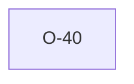

# O-40 — .ags.idx byte index records true GROUP line-starts

> Source-of-truth is `repo:observations.json` (record O-40), rendered to
> `repo:OBSERVATIONS.md#o-40` — never hand-edit the Markdown.
> This page links + cross-references only — it never copies the 5 fields.

## Summary
> [!note] **NOTE.** The `.ags.idx` certificate's byte-offset index used the `csv` crate's record positions, which are *loose*: for a CRLF-terminated line the reader's position is the preceding `\n` (off by one from the GROUP record's true line-start), and leading blank lines are absorbed (the first GROUP recorded at byte 0 instead of after the blanks). Rule 2a mandates CRLF, so the off-by-one was the common real case. #168 Phase 4 sources the offsets from the shared parse leaf's source-true byte walk instead; the `.ags.idx` format stays locked at v1 (only the offset *values* tighten). The owner ratified the tightening. First concrete csv-removal step in core.

## Rules affected
None — this concerns the `.ags.idx` certificate/index (our format), not an AGS4 numbered rule.

## Cross-observation graph

## Upstream status
Not upstream-reportable — `csv`-crate record-position semantics plus our own cert format, not an AGS4-spec or python-ags4 matter.

## Related
[[dec-ags-idx-certificate]] · [[crate-map]]
