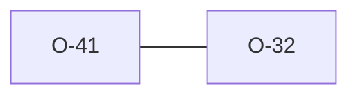

# O-41 — pre-GROUP rows are reported, not crashed on

> Source-of-truth is `repo:OBSERVATIONS.md#o-41`.
> This page links + cross-references only — it never copies the 5 fields.

## Summary
> [!variance] **VARIANCE.** A HEADING/UNIT/TYPE/DATA row before any GROUP is structurally invalid (it belongs to no group). python-ags4's *parser* hard-fails on it (`AGS4Error` / `KeyError`), so `check.py` never runs and the user gets a traceback with **no** findings report. Laterite parses leniently and **reports** each orphan as an `AGS Format Rule 2` error finding (`rules/structure.rs::rule_2_orphan_rows`), so the report stays complete — same philosophy as [[O-32]]. python-ags4 parity unchanged at 122/9. The sibling case (a code-less `GROUP` row) was already a Rule 4 finding. (#168 Phase-5 follow-up, #189.)

## Rules affected
[[rule-02-group-has-data]] — a pre-GROUP HEADING/UNIT/TYPE/DATA row is reported under Rule 2 (the row belongs to no GROUP). The core *reader* path (`ags4_codec`, opt-in strict) hard-fails on the same case instead — a data reader is a different consumer than a validator.

## Cross-observation graph

## Upstream status
Not filing — python-ags4 *could* downgrade these parser hard-fails to `check.py` findings for a more useful report, but it's a design-philosophy difference, not a defect.

## Related
[[rule-02-group-has-data]] · [[parity-model]] · [[O-32]]
