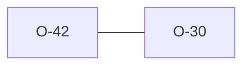

# O-42 — `"4.0"` → 4.0.4 (superset-safe) + a content guard

> Source-of-truth is `repo:OBSERVATIONS.md#o-42`.
> This page links + cross-references only — it never copies the 5 fields.

## Summary
> [!variance] **VARIANCE.** A consequence of [[O-30]]'s edition policy, fully probed. 4.0.4 is a **strict superset** of 4.0.3 (same 124 groups, 0 headings removed, 8 added, only PMTL's parent re-pointed PMTD→PMTG). python-ags4's static `"4.0"→4.0.3` alias forces the older schema onto a `"4.0"` file and over-reports **Rule 10c** (150 false PMTL orphans on a real corpus file that is actually 4.0.4 — it uses 4.0.4-only headings and its PMTL `PMTD_SEQ` is blank). Laterite resolves `"4.0"→4.0.4` (never false-flags the 8 newer headings) and adds a content guard (`guard_4_0_4`): an exact `"4.0.3"` is upgraded to 4.0.4 when the file uses a 4.0.4-only heading, with a transparency FYI. `compat`↔python parity on the real corpus is **800/801** — the lone divergence is this file, where laterite is correct. Forcing `--dict-version 4.0.3` reproduces python's 150 exactly.

Source-of-truth (never pasted): `repo:OBSERVATIONS.md#o-42`.

## Rules affected
[[rule-10c-parent-child]] — PMTL's parent group differs by edition (PMTD in 4.0.3, PMTG in 4.0.4+), the only group in the dictionary with an edition-varying parent. See also [[edition-resolution]].

> [!bug] **The guard was path-only in practice until 2026-07-14.** `guard_4_0_4`
> itself was correct from the day it landed (#222), but `laterite-py`,
> `laterite-node`, and `laterite-ags4-wasm` each hand-assembled "resolve
> `TRAN_AGS`, then run the rules" for their bytes/text branches instead of
> calling the same door a path read used — and every one of them left the
> guard out of that assembly. So a file whose `TRAN_AGS` declared 4.0.3 while
> using a 4.0.4-only heading was judged against 4.0.4 from a path and 4.0.3
> from bytes/text: the documented behaviour above was only ever true for the
> `lat` binary and `check_file_with_dict`. Fixed by a new door,
> `check_parsed_with_dict` (`repo:rust-packages/laterite-ags4-validator/src/lib.rs`),
> that every modality now goes through — see [[laterite-ags4-validator]] and
> [[cert-trust-v2]] (the same "surfaces reach past the door" root cause as
> that page's `check_files` bug). No change to the guard's *logic* or to this
> observation's 5 fields — this was an internal wiring gap, not a new
> spec/python-ags4 fact.

## Cross-observation graph

## Upstream status
> [!note] Upstream-reportable: **[YES]** — python-ags4's static `"4.0"→4.0.3` alias is stale (never bumped when 4.0.4 shipped); it over-reports Rule 10c and would mis-flag the 8 4.0.4 headings as non-standard.

_Reported: 2026-06-22._

## Related
[[O-30]] · [[rule-10c-parent-child]] · [[parity-model]] · [[edition-resolution]] · [[laterite-ags4-validator]] · [[cert-trust-v2]] · [[testing-strategy]]
