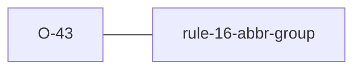

# O-43 — non-standard self-declared abbreviation → FYI (Related to Rule 16)

> Source-of-truth is `repo:observations.json` (record O-43), rendered to
> `repo:OBSERVATIONS.md#o-43` — never hand-edit the Markdown.
> This page links + cross-references only — it never copies the 5 fields.

## Summary
> [!variance] **VARIANCE — laterite-originated, no python-ags4 equivalent.** AGS Rule 16 is satisfied by *defining* a `PA` value in the file's ABBR group, even if the code is not in the standard picklist (a typo `SAMP_TYPE="Borng"`, or an invented `"ZZ"`). The file is spec-legal, so it is no error — but the non-standard code does not interoperate with tooling that keys off the standard list. Laterite surfaces this as an **FYI** (opt-in, `include_fyi` / `--show-fyi`) via `rule_16_fyi_nonstandard_abbr`, bounded to headings that HAVE a bundled standard picklist (custom / DICT-defined `PA` headings are skipped). Deliberately an FYI, not a WARNING — the file breaks no rule (owner decision, #199); the WARNING tier stays empty. python-ags4 has no such check (its `fyi_16_1` only flags description drift on an *otherwise-standard* code; its Warnings section is unimplemented).

Source-of-truth (never pasted): `repo:observations.json`, record O-43 — rendered at `repo:OBSERVATIONS.md#o-43`.

## Rules affected
[[rule-16-abbr-group]] — complements the error-tier Rule 16 (PA value must be defined in ABBR) and the description-drift `rule_16_fyi`. This FYI fires on the case `rule_16_fyi` skips: the declared code is not itself standard.

## Cross-observation graph

## Upstream status
> [!note] Upstream-reportable: **[NO]** — this is an additive laterite feature, not a defect in python-ags4. It could be suggested upstream as an enhancement (their Warnings section is unimplemented), but there is no divergence to report.

## Related
[[rule-16-abbr-group]] · [[parity-model]]
