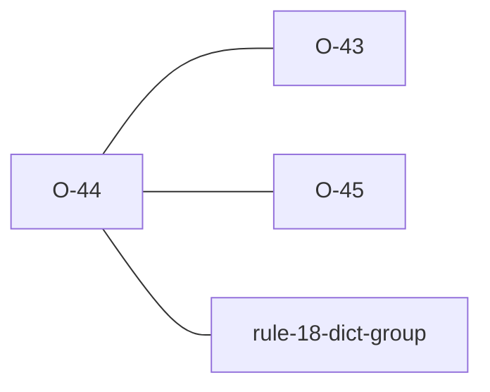

# O-44 — malformed DICT group → WARNING (Related to Rule 18)

> Source-of-truth is `repo:observations.json` (record O-44), rendered to
> `repo:OBSERVATIONS.md#o-44` — never hand-edit the Markdown.
> This page links + cross-references only — it never copies the 5 fields.

## Summary
> [!variance] **VARIANCE — laterite-originated; the first WARNING-tier producer.** AGS Rule 18 requires a DICT group when non-standard names are used, but says nothing about the DICT's OWN well-formedness. The engine only *consumes* DICT (Rules 7/9) — a malformed DICT (missing `DICT_TYPE`/`DICT_GRP`/`DICT_HDNG` column, blank `DICT_GRP`, or a `HEADING` row with a blank `DICT_HDNG`) silently degrades every downstream check. `rule_18_structure` (gated under `include_warnings`) flags the clearest defects as opt-in WARNINGs under a `Warning (Related to Rule 18)` label. **WARNING, not Error** — python-ags4 does no DICT structural validation, so an error would break the 122/9 parity baseline; opt-in + a separate label keep the default verdict, the compat path, and the error-tier Rule 18 bucket all unchanged. WARNING over FYI (cf. [[O-43]]): a malformed DICT is genuinely broken, not merely spec-legal-but-unusual.

Source-of-truth (never pasted): `repo:observations.json`, record O-44 — rendered at `repo:OBSERVATIONS.md#o-44`.

## Rules affected
[[rule-18-dict-group]] — complements the error-tier Rule 18 (a non-standard heading with no DICT group; see O-17) by validating the DICT group's own structure when it IS present.

## Cross-observation graph

## Upstream status
> [!note] Upstream-reportable: **[NO]** — an additive laterite feature, not a python-ags4 defect. Could be suggested upstream as an enhancement (their Warnings section is unimplemented), but there is no divergence to report.

## Related
[[rule-18-dict-group]] · [[parity-model]] · [[O-43]] · [[O-45]]
