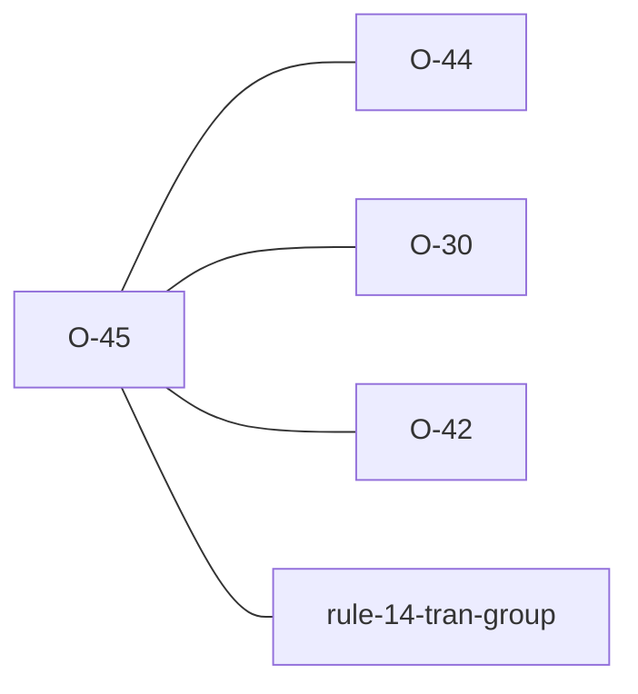

# O-45 — unrecognised TRAN_AGS → WARNING (Related to Rule 14)

> Source-of-truth is `repo:OBSERVATIONS.md#o-45`.
> This page links + cross-references only — it never copies the 5 fields.

## Summary
> [!variance] **VARIANCE — laterite-stricter categorisation; the second WARNING-tier producer (cf. [[O-44]]).** A `TRAN_AGS` value that is PRESENT (so Rule 14 is satisfied) but is not a recognised AGS4 edition makes laterite fall back to a default dictionary and possibly validate against the wrong schema (see [[edition-resolution]]). python-ags4 emits this only as an opt-in `FYI`; laterite classifies the same condition as a `Warning (Related to Rule 14)` and — since #203 made the WARNING tier shown by default — surfaces the schema-fallback risk **without a flag**. In FYI-only mode (i.e. `compat`, which runs `include_fyi` without `include_warnings`) the engine still emits the python-ags4-matching `FYI`, so drop-in fidelity is preserved. **WARNING, not Error** — `TRAN_AGS` is present (no Rule 14 violation) and an error would break the 122/9 baseline; error-parity is untouched ([[parity-model]] compares only `AGS Format Rule N` keys, and `compat` still emits the FYI).

Source-of-truth (never pasted): `repo:OBSERVATIONS.md#o-45`.

## Rules affected
[[rule-14-tran-group]] — Rule 14 requires `TRAN_AGS` to be *present*, not *recognised*; the unrecognised-edition WARNING is adjacent (it governs which dictionary the rest of the check runs against, see [[edition-resolution]]).

## Cross-observation graph

## Upstream status
> [!note] Upstream-reportable: **[NO]** — a laterite categorisation choice, not a python-ags4 defect; python-ags4's FYI is a legitimate, if softer, call. There is no divergence to report.

## Related
[[rule-14-tran-group]] · [[edition-resolution]] · [[parity-model]] · [[O-44]]
