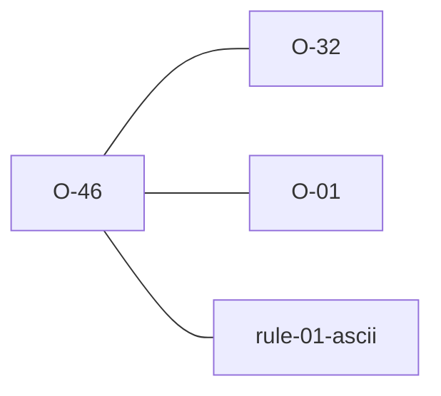

# O-46 — lean read rejects non-UTF-8, the validator decodes it lossily

> Source-of-truth is `repo:observations.json` (record O-46), rendered to
> `repo:OBSERVATIONS.md#o-46` — never hand-edit the Markdown.
> This page links + cross-references only — it never copies the 5 fields.

## Summary
> [!note] **NOTE — a laterite cross-surface fork, not a python-ags4 divergence.** After the parser convergence (#168) the two paths through the shared parse leaf answer a non-UTF-8 file differently *on purpose*. The **lean read path** (`read_ags4_bytes`, backing the `.ags.idx` byte index and the DuckDB extension) **rejects** it — it assumes an already-valid file, and a byte index is only meaningful over the exact source bytes, so a loud failure is the honest one. The **validator path** does not reject: it decodes lossily and reports Rule 1, matching python-ags4's `errors="replace"` — a validator has to produce a *complete* report, not stop at the first bad byte. So the python-facing surface still agrees with python-ags4 via [[O-32]]; nothing here touches parity. #168 Phase 7 pinned the lean path's wording to the shared leaf's `"input is not valid UTF-8"` so the two producers can't drift apart in message text either.

Source-of-truth (never pasted): `repo:observations.json`, record O-46 — rendered at `repo:OBSERVATIONS.md#o-46`.

## Rules affected
[[rule-01-ascii]] — a non-UTF-8 byte is out-of-spec under Rule 1 either way; what differs is which surface *surfaces* it, and how.

## Cross-observation graph

## Upstream status
Not upstream-reportable — an internal cross-surface design choice. The python-ags4-facing behaviour is [[O-32]], and that is where the parity question lives.

## Related
[[rule-01-ascii]] · [[crate-map]] · [[parity-model]] · [[O-32]] · [[O-01]]
