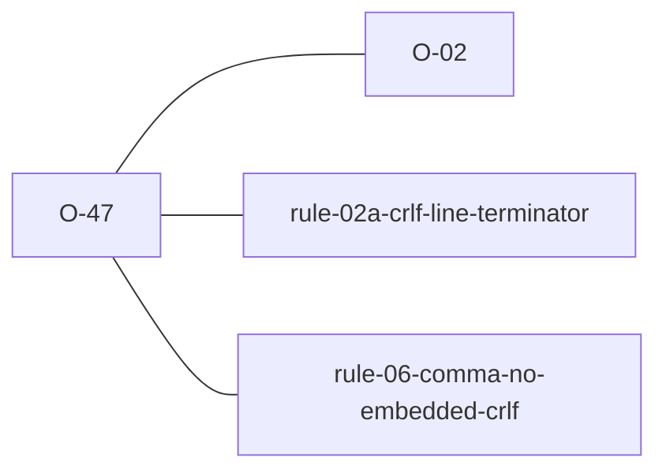

# O-47 — quote-aware universal-newline line splitting (#422)

> Source-of-truth is `repo:observations.json` (record O-47), rendered to
> `repo:OBSERVATIONS.md#o-47` — never hand-edit the Markdown.
> This page links + cross-references only — it never copies the 5 fields.

## Summary
> [!note] **NOTE — a correctness gain on both axes, and the change that moved the parity baseline 122/9 → 121/10.** Line-finding is now quote-aware and universal-newline (`laterite-ags4-parse::line_spans`), and it is the ONE splitter used by both the parser and `apply_fixes`, so their line numbering agrees by construction. A CR/LF **outside** quotes is a *terminator* — `\r\n` conforming, a lone `\r`/`\n` → [[rule-02a-crlf-line-terminator]]; a CR/LF **inside** a quoted field is *embedded content* → [[rule-06-comma-no-embedded-crlf]] (widened to catch LF as well as CR), with the row kept whole. Two consequences: lone-CR files now split into proper rows with per-row Rule 2a, **converging** with python-ags4; and embedded-newline fields keep their row and report Rule 6 where python tears them into Rule 4/5, **diverging** — which is the [[O-02]] "better than python" behaviour finally realised end-to-end. The old lone-CR data-corruption path is eliminated *by construction*: `StripEmbeddedCr` can no longer be handed a terminator-CR, because terminators are consumed by the splitter and never left in the line body.

Source-of-truth (never pasted): `repo:observations.json`, record O-47 — rendered at `repo:OBSERVATIONS.md#o-47`.

## Rules affected
[[rule-02a-crlf-line-terminator]] (terminators) · [[rule-06-comma-no-embedded-crlf]] (embedded CR/LF) — §4.1.1 attributes a lone-CR *terminator* to Rule 2a and an *embedded* CR/LF to Rule 6, so both attributions are now spec-correct. [[rule-04-field-count]] and [[rule-05-quoting]] are what python-ags4 reports instead, as tear symptoms.

## Cross-observation graph

## Upstream status
Only partially, and nothing new: python-ags4's quote-blind reader plus its no-op `rule_6` mean it *structurally* cannot report an embedded newline as Rule 6. That is already the upstream item under [[O-02]], so no separate proposal is raised here.

## Related
[[rule-02a-crlf-line-terminator]] · [[rule-06-comma-no-embedded-crlf]] · [[parity-model]] · [[O-02]]
