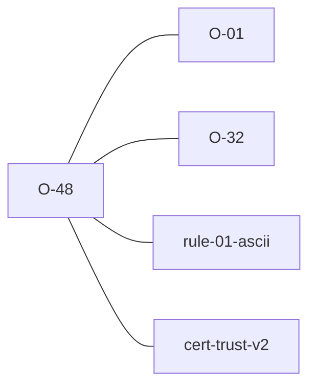

# O-48 — the decoder is part of the verdict

> Source-of-truth is `repo:observations.json` (record O-48), rendered to
> `repo:OBSERVATIONS.md#o-48` — never hand-edit the Markdown.
> This page links + cross-references only — it never copies the 5 fields.

## Summary
> [!note] **NOTE — not a divergence; a shared property with a sharp consequence.** Rule 1
> sorts *characters* by code point (128–255 tolerated as an FYI, above that an error), but
> a byte sequence has no characters until something decodes it — so the verdict is a
> function of `(bytes, decoder)`. Probed through **both** validators on one unchanged file:
> a `PROJ_NAME` carrying `Ω` (UTF-8 bytes `CE A9`) is **one** code point (937) read as
> UTF-8 → a Rule 1 **error**, and **two** code points (206, 169) read as windows-1252 →
> only an **FYI**. They agree, finding for finding, in both directions; python-ags4 even
> words its own message *"assuming that file encoding is '{encoding}'"*. Harmless while a
> verdict is computed fresh — **a false-clean generator the moment one is cached**, which
> is what the `.ags.idx` certificate does. See [[cert-trust-v2]] and
> [[encoding-is-part-of-the-verdict]].

Source-of-truth (never pasted): `repo:observations.json`, record O-48 — rendered at `repo:OBSERVATIONS.md#o-48`.

## Rules affected
[[rule-01-ascii]] — the code-point bands are [[O-01]]'s (0–127 clean, 128–255 FYI, above
that an error); [[O-32]] covers the adjacent case of *invalid* bytes (lossy decode →
`U+FFFD` → the same error arm). This observation is about **valid** bytes decoding
*differently* under two different labels.

## Cross-observation graph

## Upstream status
> [!note] Upstream-reportable: **[NO]** — both validators behave identically, and
> python-ags4's finding text already discloses the assumption. The consequence is ours: it
> lands on anything that **caches** a verdict, so the certificate must record the decoder
> that produced it.

## Related
[[rule-01-ascii]] · [[O-01]] · [[O-32]] · [[cert-trust-v2]] · [[encoding-is-part-of-the-verdict]]
