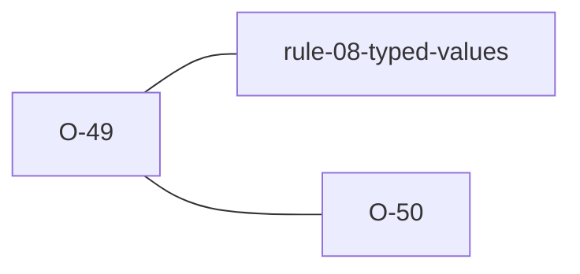

# O-49 — the TYPE-declared count is an uncapped format width

> Source-of-truth is `repo:observations.json` (record O-49), rendered to
> `repo:OBSERVATIONS.md#o-49` — never hand-edit the Markdown.
> This page links + cross-references only — it never copies the 5 fields.

## Summary
> [!variance] **VARIANCE — a shared latent formatter defect, now asymmetric
> after the fix.** The `n` in an AGS4 numeric TYPE (`"3SF"`, `"3DP"`,
> `"3SCI"`) is parsed straight off the file's own TYPE row and used as a
> significant-figure/decimal-place format WIDTH — Rule 8's grammar check, the
> fixes engine, and the XLSX writer all do this, and nothing caps it (real
> AGS TYPEs are single-digit, 0–6). **python-ags4** (`_format_SF` and the
> DP/SCI siblings) computes the width as an arbitrary-precision Python int,
> so a crafted `"9999999999SF"` requests a ~10 GB string → MemoryError/DoS —
> empirically probed 2026-07-20 through the real upstream function (linear,
> uncapped growth: `10000000SF` → a 10,000,001-char string). **laterite was
> also vulnerable pre-#610** — `format_nsf`'s `(n as i32)` cast wrapped
> `9999999999` to a *positive* `1_410_065_407` → a ~1.4 GB width → OOM;
> `format_ndp`/`format_nsci` fed a bare `usize` straight into `{:.n$}`. laterite-dev#610
> clamps every count-driven formatter (6 sites, `laterite-ags4-types` +
> `laterite-ags4-excel`) to `MAX_NUMERIC_COUNT = 30` first — a bounded-output
> change only, since no real AGS TYPE reaches it. `L.validate(<crafted
> file>)` now returns in 1 ms. See
> [[numeric-type-count-uncapped-format-width]] for the full account,
> including the separate, opposite-direction `0DP` conversion issue now
> ratified as [[O-50]] (laterite-dev#611) — unbounded OUTPUT here, unbounded INPUT into
> a bounded `i64` store there.

Source-of-truth (never pasted): `repo:observations.json`, record O-49 — rendered at `repo:OBSERVATIONS.md#o-49`.

## Rules affected
[[rule-08-typed-values]] — the grammar check is the validator's own path to
the formatter; the fixes engine and the XLSX writer (`laterite-ags4-excel`) are
the other two call sites of the same count-driven `nDP`/`nSF`/`nSCI` family
([[nDP]] · [[nSF]] · [[nSCI]]).

## Cross-observation graph

## Upstream status
> [!note] Upstream-reportable: **[YES]** — python-ags4's `_format_SF` /
> `_format_DP` / `_format_SCI` OOM (MemoryError) on a crafted numeric-TYPE
> count computed at arbitrary Python-int precision. A malformed or hostile
> AGS4 file DoSes any python-ags4 caller that renders a value to its
> expected form (Rule 8 fixes, XLSX export). Candidate upstream report.

_Not yet marked Reported in OBSERVATIONS.md._

## Related
[[rule-08-typed-values]] · [[nDP]] · [[nSF]] · [[nSCI]] · [[numeric-type-count-uncapped-format-width]] · [[O-50]] · [[python-ags4]]
