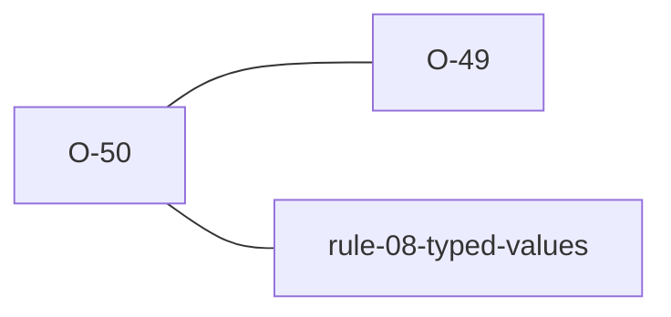

# O-50 — the 0DP conversion step fabricated a value; the validation itself never diverged

> Source-of-truth is `repo:observations.json` (record O-50), rendered to
> `repo:OBSERVATIONS.md#o-50` — never hand-edit the Markdown.
> This page links + cross-references only — it never copies the 5 fields.

## Summary
> [!variance] **VARIANCE — a conversion divergence, not a validation one.** A
> `0DP` (integer) cell whose value cannot be a clean in-range `i64` — a huge
> `"1E30"`, a tiny `"1E-30"`, a fractional `"5.7"` — is already flagged by
> **both** validators via the identical strict Rule 8 regex `^-?\d+\.?$`
> (laterite's `is_ndp(s, 0)`); the divergence lives only in the separate
> string→number CONVERSION step. **python-ags4**
> (`AGS4.py::convert_to_numeric`, `int(float(s))`) converts at arbitrary
> Python-int precision — `"1E30"` → the exact
> `1000000000000000019884624838656` — and never fabricates. **laterite**
> used a saturating `f as i64`, so `"1E30"` became the fabricated
> `9223372036854775807` — a wrong number that was never in the file. laterite-dev#611
> replaced that with a range guard (`parse_ags_integer`): out-of-`i64` →
> Null; in-range untouched, so `_content_hash` is byte-identical for every
> real value. Real geotech `0DP` columns never approach `i64`'s ~9.2e18
> ceiling (the biggest, a cyclic-triaxial cycle count, is ~1e4), so the guard
> only fires on an already-flagged Excel/export error. Full-precision
> preservation was considered and deferred. laterite-dev#611 also finishes the laterite-dev#531
> single-sourcing — `parse_ags_integer`/`parse_ags_decimal` are now the one
> source for the leaf's `parse_value`/`ags4_str` AND laterite-py's PyO3
> wrapper. See [[0dp-integer-conversion-precision-loss]] for the full
> account, and [[O-49]] for the sibling numeric-TYPE-count DoS (opposite
> direction on the same formatter family: unbounded OUTPUT there, unbounded
> INPUT into a bounded store here).

Source-of-truth (never pasted): `repo:observations.json`, record O-50 — rendered at `repo:OBSERVATIONS.md#o-50`.

## Rules affected
[[rule-08-typed-values]] — Rule 8's strict `0DP` grammar check already flags
every value this observation is about; the divergence is entirely in the
conversion step ([[nDP]]'s `n = 0` case) that runs after the check passes.

## Cross-observation graph

## Upstream status
> [!note] Upstream-reportable: **[NO]** — python-ags4's numeric conversion is
> not defective here; it preserves precision, and WE were the lossy side
> (silent saturation). laterite-dev#611 fixes it on our side; recorded for our own
> decision trail and as the sibling of [[O-49]] (the Class B count-DoS, where
> python-ags4 IS the reportable side).

_Not reported upstream (nothing to report — this is our own fix)._

## Related
[[rule-08-typed-values]] · [[nDP]] · [[O-49]] · [[0dp-integer-conversion-precision-loss]] · [[python-ags4]]
