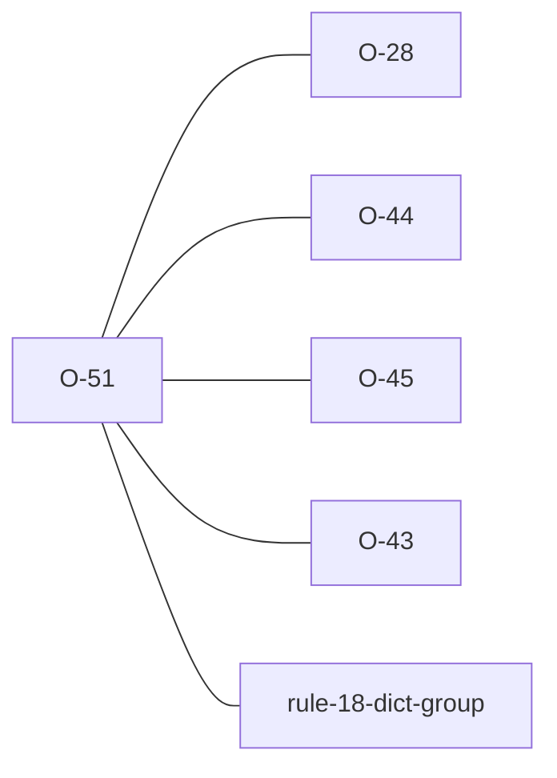

# O-51 — custom-overlay overrides of the standard schema

> Source-of-truth is `repo:observations.json` (record O-51), rendered to
> `repo:OBSERVATIONS.md#o-51` — never hand-edit the Markdown.
> This page links + cross-references only — it never copies the 5 fields.

## Summary
> [!variance] **VARIANCE — a laterite-only check, because python-ags4's data model cannot pose the question.** Both tools accept a custom dictionary. python-ags4's **replaces** the bundled standard outright, so there is nothing left to compare an override against. laterite's `--dict` has a second mode — an **overlay** (see [[dec-custom-dict-overlay]]) — and only there can a bespoke dictionary redefine something standard while the standard is still in view. Each such redefinition is reported, split across two tiers by the surprise test in [[dec-verdict-severity-split]]: re-parenting a standard group and demoting a standard KEY both change **row identity**, so rules that key off parentage and KEYs answer differently about rows nobody edited — a WARNING. A plain type/status override is declared by the caller and honoured exactly as declared, with nothing downstream differing from what the file says — an FYI. Neither tier decides the verdict.

Source-of-truth (never pasted): `repo:observations.json`, record O-51 — rendered at `repo:OBSERVATIONS.md#o-51`.

## Why the migrant is not the population at risk

The obvious worry — a python-ags4 user porting a `-d/--dictionary_path` workflow and meeting findings their old tool never emitted — inverts on inspection. A path argument puts python-ags4 in **replacement** mode, and laterite's replacement mode emits none of these (`if !custom.fall_through { return; }` — a replacement is *declared*, not an override). The findings exist only for the overlay mode python-ags4 has no equivalent of, so for the migrant the exposure is not small; it is structurally zero.

## Rules affected
[[rule-18-dict-group]] — Rule 18 governs the file-level `DICT` group. These findings are adjacent rather than a rule check: they describe the *dictionary the rules are run against*, not the file, which is why they carry their own labels rather than a rule number.

## Cross-observation graph

## Upstream status
> [!note] Upstream-reportable: **[NO]** — an additive laterite feature. python-ags4's replacement model makes the comparison impossible rather than merely unimplemented, so there is no defect to report.

## Related
[[dec-custom-dict-overlay]] · [[dec-verdict-severity-split]] · [[laterite-ags4-validator]] · [[O-44]]
