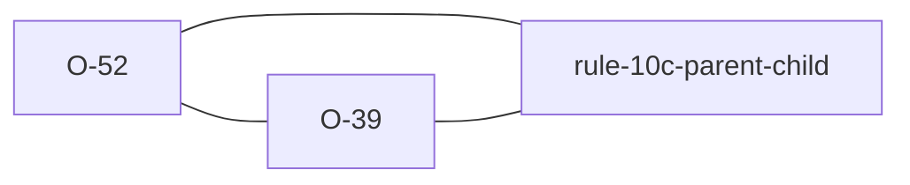

# O-52 — the declined parentage check says so

> Source-of-truth is `repo:observations.json` (record O-52), rendered to
> `repo:OBSERVATIONS.md#o-52` — never hand-edit the Markdown.
> This page links + cross-references only — it never copies the 5 fields.

## Summary
> [!variance] **VARIANCE — a laterite-only warning, because python-ags4 never knows it declined anything.** [[O-39]] settled that a child row whose parent-KEY cells are all empty claims no parent, so Rule 10c has nothing to check. What it did not settle is what the report should say. Saying nothing makes a declined check identical to a passed one, and a lab control is then indistinguishable from a key someone blanked by accident. The check is still declined and the verdict still does not move; the decline is now stated, at the warning tier.

## Why python-ags4 cannot have an equivalent

Not "has not written one" — cannot pose the question. `check.py::rule_10c` has no skip: it left-merges the child table onto the parent on the parent's KEY fields and reports every unmatched row. Nothing in it distinguishes *this row claims no parent* from *this row's parent is missing*, because it never asks.

The rows go unreported for a reason nobody chose. python-ags4's `tables` carry the HEADING/UNIT/TYPE pseudo-rows as DataFrame rows, on **both** sides of the merge. The parent's UNIT row has empty cells in the key columns, so an all-empty child key **matches it**. The TYPE rows match each other for a different reason again — both carry the same declared type token, `ID` against `ID`. Two coincidences with one cause: pseudo-rows in a data merge. The permissiveness [[O-39]] describes is real in its outputs and accidental in its cause.

## The demonstration

Two files, identical but for one cell — the parent `LOCA` group's UNIT row under `LOCA_ID`:

| that UNIT cell | python-ags4's Rule 10c |
| --- | --- |
| empty (the ordinary case) | nothing |
| `m` | two orphans — the child's own UNIT row, and the standalone DATA row |

Exactly two, and the TYPE row is not among them: it never depended on the emptiness, so changing the UNIT cell does not disturb it.

Both files are legal. Nothing else in either report differs. Which is why the upstream note is a **[BUG]** rather than an ambiguity: the merge should exclude the pseudo-rows, and then decide the empty-key case deliberately — either way — instead of inheriting an answer from a coincidence.

## Rules affected
[[rule-10c-parent-child]] — the warning carries `Warning (Related to Rule 10c)`, the same label shape Rule 18's warning uses, and rides the warning tier, so it is shown by default and decides nothing.

## Cross-observation graph

## Upstream status
> [!note] Upstream-reportable: **[BUG]** — python-ags4's Rule 10c merge includes the UNIT/TYPE pseudo-rows on both sides. Benign wherever the coincidence lines up; a parent group whose UNIT row carries a value in a KEY column turns the child's own UNIT row into a reported orphan. Registered in [[strat-ags-dfwg-upstream-list]].

## Related
[[O-39]] · [[rule-10c-parent-child]] · [[parity-model]]
