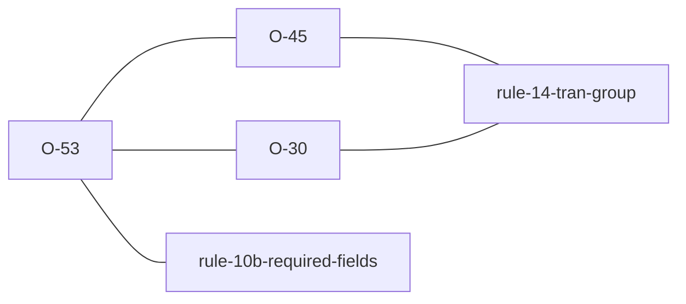

# O-53 — where the fallback gets announced

> Source-of-truth is `repo:observations.json` (record O-53), rendered to
> `repo:OBSERVATIONS.md#o-53` — never hand-edit the Markdown.
> This page links + cross-references only — it never copies the 5 fields.

## Summary
> [!variance] **VARIANCE — not a difference in strictness, a difference in what the fact is a property of.** The record has the two behaviours; the thing worth carrying away is that neither engine is quiet here, so reading this as "they report it and we don't" gets it backwards. python-ags4 treats the schema fallback as a property of the offending **cell**; laterite treats it as a property of the **verdict**. Everything else follows from that one choice — how many findings it costs, whether a default run shows it, and whether it repeats itself once a second cell is wrong.

## Why this is not [[O-45]]

[[O-45]] scopes itself to a `TRAN_AGS` that is **present** — Rule 14 satisfied — but not a recognised edition. That is the case where the file breaks no rule and the risk would otherwise go unstated, which is what earned the promotion to WARNING.

A blank is the complement of that scope, and `tran_ags_unrecognised` returns early on it deliberately rather than by omission. The cell is already an error under [[rule-10b-required-fields]] and the author must fix it either way; a softer second line about the same cell adds no instruction.

## Where each engine puts it

| | python-ags4 | laterite |
| --- | --- | --- |
| carried as | a per-cell `FYI` | the report's own header |
| shown when | the FYI tier is asked for | every run, every tier |
| says which schema was used | yes | yes |
| costs a finding | yes, on an already-flagged cell | no |

The laterite side is observable without a flag: `lat validate` prints the resolved edition and how it was reached on its first line, and the two readings are distinguishable — a resolved file is annotated `(exact)`, a fallen-back one `(fallback)`. The same pair is on the report object as `dict_version` and `resolution`.

That asymmetry is why the difference is invisible to the parity gate and was invisible to the demo state map for its first revision: the gate compares `AGS Format Rule N` keys only, and an `FYI` key is not one.

## Rules affected
[[rule-10b-required-fields]] — the finding a blank REQUIRED cell actually earns, and the one laterite is content to leave as the whole story. [[rule-14-tran-group]] — the rule the edition label belongs to, satisfied here in the sense that matters to it: the heading is present.

## Cross-observation graph

## Upstream status
> [!note] Upstream-reportable: **[NO]** — the record carries the reasoning. Nothing is registered in [[strat-ags-dfwg-upstream-list]] for this one.

## Related
[[O-45]] · [[O-30]] · [[rule-10b-required-fields]] · [[rule-14-tran-group]] · [[parity-model]]
