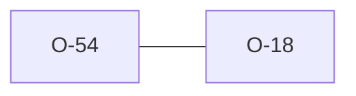

# O-54 — Rule 16a is covered under Rule 16, but the default concatenator is not

> Source-of-truth: `repo:observations.json` (record O-54), rendered at `repo:OBSERVATIONS.md#o-54`.
> This page links + cross-references only — it never copies the 5 fields.

## Summary
> [!spec] **SPEC.** Rule 16a is implemented — inside Rule 16, with no id of its own, in both engines. What neither implements is the default the prose names for a missing `TRAN_RCON`, so a concatenated field is reported as one undefined abbreviation rather than split into its parts.

Source-of-truth (never pasted): `repo:observations.json`, record O-54 — rendered at `repo:OBSERVATIONS.md#o-54`.

## Why this record exists at all
A rule that is implemented but carries no id of its own is invisible to the
instrument people reach for. `ags_rules()` and `rules_meta.json` enumerate
implemented **checks**; a spec **rule** whose enforcement lives under a
neighbour's id appears in neither. Rule 16a is the second such case in this
catalogue and it sits one rule from the first — see [[O-18]] for Rule 18a, which
is the same shape for a different reason (18a has no check at all; 16a has one
under another name).

## Rules affected
[[rule-16-abbr-group]] · [[rule-11b-tran-rcon]] · [[rule-14-tran-group]]

## Cross-observation graph

## Upstream status
Reportable — **[SPEC]**. Two independent implementations both ignore a default
the prose states outright, which is better evidence that the sentence is doing
no work than either engine would be on its own. Not yet filed.

## Related
[[parity-model]] · [[upstream-reporting]] · [[O-18]]
