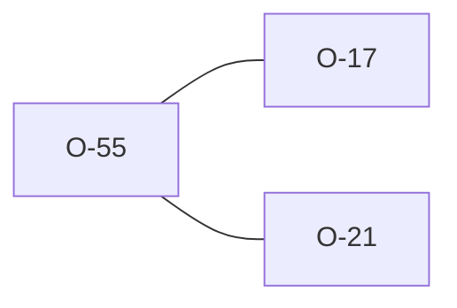

# O-55 — DICT_PGRP is conditionally REQUIRED, merely permitted, and unmentioned

> Source-of-truth: `repo:observations.json` (record O-55), rendered at `repo:OBSERVATIONS.md#o-55`.
> This page links + cross-references only — it never copies the 5 fields.

## Summary
> [!spec] **SPEC.** Three clauses in the DICT group definition answer the same question three ways: whether `DICT_PGRP` must carry data on a `DICT_TYPE='GROUP'` row. The heading table says it is required, the Group Notes say it is permitted, and the Group Rules bullet — the one that enumerates exactly which headings shall carry data on such a row — does not mention it.

Source-of-truth (never pasted): `repo:observations.json`, record O-55 — rendered at `repo:OBSERVATIONS.md#o-55`.

## Why this record exists at all
Both engines resolve the ambiguity the same way, so nothing here is a
divergence and the record carries no `user_facing` block — it does not reach
`repo:web/docs-site/docs/reference/divergences.md`. What makes it worth a record
is that the agreement is **not** derivable from the document: a reader who takes
the Group Rules bullet as the authoritative enumeration for GROUP rows would
build a consumer that treats a file-declared group's parent as optional, and
would be reading the spec correctly when they did.

That is the question this clause decides, and it is live: a consumer resolving
parentage for user-defined groups has to know whether the parent is guaranteed
present or merely often present. See [[effective-dictionary]] for what a
file-declared group otherwise contributes.

## Rules affected
[[rule-18-dict-group]] · [[rule-10c-parent-child]]

The obligation is stated (or not) in Rule 18's group definition; the consequence
of a blank one is reported under Rule 10c, one rule away from where the reader
looks for it.

## Cross-observation graph

[[O-17]] is the neighbouring DICT finding — Rule 18 keying off heading
membership rather than GROUP names. [[O-21]] is the other half of the parentage
path: Rule 10c's parentless-group list is hardcoded rather than derived from the
dictionary, so the rule that reports a blank `DICT_PGRP` is already not reading
parentage the way the dictionary states it.

## Upstream status
Reportable — **[SPEC]**. The fix is one line, and the same page already shows
what it should look like: the Group Rules bullet for `DICT_TYPE='HEADING'`
names every heading the table marks conditionally required for HEADING rows.
The GROUP bullet omits the one that applies to it. Not yet filed.

## Related
[[parity-model]] · [[upstream-reporting]] · [[effective-dictionary]] · [[O-17]] · [[O-21]]
