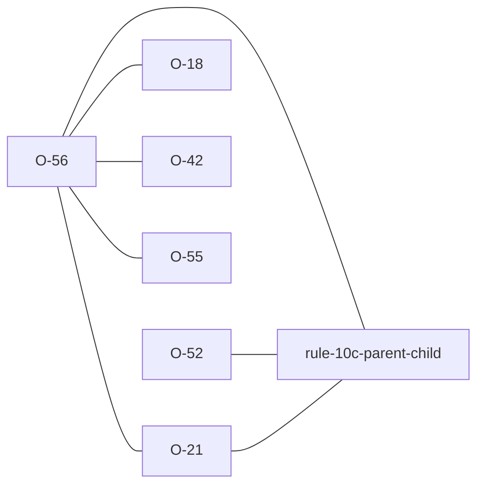

# O-56 — the link Rule 10c never asks about

> Source-of-truth is `repo:observations.json` (record O-56), rendered to
> `repo:OBSERVATIONS.md#o-56` — never hand-edit the Markdown.
> This page links + cross-references only — it never copies the 5 fields.

## Summary
> [!spec] **SPEC — one group, one parent, and a KEY tuple that can name two.** Rule 10c asks a single question per group: does this row's copy of the **declared** parent's KEY tuple exist in that parent? A KEY heading belonging to any other group is not in that tuple, so the link it stands for is never asked about — and a reference through it can point at a row that does not exist while the file validates clean. Neither engine is wrong; the format has no way to declare the second link. laterite says so, at the advisory tier.

## Why it is a format question and not a bug

The three-arm demonstration is what separates them. Take a group that declares a
grandparent while keying on a heading owned by the parent, orphan a value in
that heading, and:

| declared parent | value orphaned | Rule 10c |
| --- | --- | --- |
| the grandparent (as issued) | yes | silent |
| the owner | yes | fires |
| the owner | no | silent |

The third row is the control. The same data satisfies the tighter parentage, so
the looser declaration was never forced by the material — which is exactly why
the silence in row one is worth a word rather than a shrug.

`repo:observations.json` carries the worked instance and the dictionary's own.

## Why the containment test is the whole check

Reporting every foreign KEY heading would be a false-positive generator, because
a group that could not have been the parent is not a missed parent. The owner is
a candidate only where the child's KEY tuple contains the owner's **whole**
tuple. `DISC` is the shipped counter-example that forces the test, and it is in
the dictionary rather than hypothetical.

Two classes are dropped without a finding, and both are deliberate rather than
oversights:

- the PARENTLESS groups, where 10c checks **no** link at all ([[O-21]]) — an
  advisory naming one of them would imply the others were checked;
- a KEY heading whose 4-letter prefix names no group in the effective
  dictionary. Not an edge case: the specimen headings are KEY across the whole
  lab-test family and no SPEC group has ever existed, so without the filter that
  entire family would carry a permanent advisory about a parent that is not
  there.

## Advisory, not error — and why that was decided rather than assumed

The dictionary itself ships the shape, so an error tier would fail conformant
files. That puts it on the footing [[O-18]] put Rule 18a on: catalogued,
described, and not applied as a verdict. The tier is FYI, off unless a caller
asks for it (`lat validate --show-fyi`), and it never moves `is_valid`.

Which instances exist is edition-dependent — [[O-42]] is the record of PMTL's
parent moving between editions, and its KEY tuple moved again afterwards, so the
advisory appears and disappears across the bundled dictionaries for reasons that
have nothing to do with the file being validated.

## Rules affected
[[rule-10c-parent-child]] — the advisory carries `FYI (Related to Rule 10c)`,
the second bucket on that rule beside the declined-parentage warning ([[O-52]]).
Both say a link was not checked; that one is a check the rule **declined**, this
one is a check the rule was never able to make.

## Cross-observation graph

## Upstream status
> [!note] Upstream-reportable: **[SPEC]** — the AGS dictionary ships groups whose KEY tuple carries a heading owned outside their declared parent chain, and AGS4 gives a group one `DICT_PGRP` ([[O-55]]), so no validator can check the second link. Reportable both ways round: declare the tighter parentage where the KEY tuple already allows it, and give the format a way to say so where it does not. Registered in [[strat-ags-dfwg-upstream-list]].

## Related
[[rule-10c-parent-child]] · [[O-52]] · [[O-21]] · [[O-18]] · [[O-42]] · [[O-55]] · [[parity-model]]
