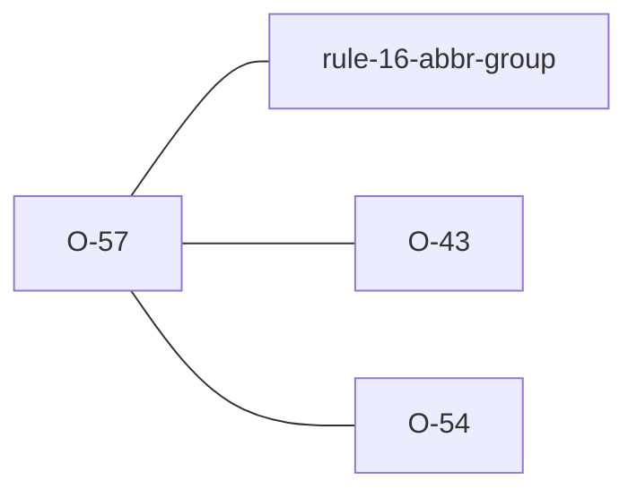

# O-57 — padded PA value → FYI (Related to Rule 16) + safe trim fix

> Source-of-truth is `repo:observations.json` (record O-57), rendered to
> `repo:OBSERVATIONS.md#o-57` — never hand-edit the Markdown.
> This page links + cross-references only — it never copies the 5 fields.

## Summary
> [!variance] **VARIANCE — laterite-originated, no python-ags4 equivalent.** A `PA` value such as `" D"` fails Rule 16 in both engines when only `"D"` is defined, and the finding names a missing code rather than the padding. Laterite keeps that error exactly as it is (compat's rewrite of it depends on the wording) and adds a separate opt-in FYI naming the code the value matches once trimmed. `fix` repairs it in the safe tier, and only when every failing part of the cell is rescued by trimming.

Source-of-truth (never pasted): `repo:observations.json`, record O-57 — rendered at `repo:OBSERVATIONS.md#o-57`.

## Rules affected
[[rule-16-abbr-group]] — the FYI and the lookup both come from `rule_16` in `repo:rust-packages/laterite-ags4-validator/src/rules/groups.rs`; the repair is the Rule 16 block in `repo:rust-packages/laterite-ags4-validator/src/fixes.rs`, which reuses the same lookup so it can only touch cells the rule flags.

## Cross-observation graph

- [[O-43]] — the other laterite-originated FYI in the same `FYI (Related to Rule 16)` bucket; that one fires when a code is defined but non-standard, this one when the value around a defined code is padded.
- [[O-54]] — with no usable `TRAN_RCON` a value is not split, so the FYI and the fix trim the whole value.

## Upstream status
> [!note] Upstream-reportable: **[NO]** — an additive laterite advisory and repair, not a python-ags4 defect or a spec ambiguity.

## Related
[[rule-16-abbr-group]] · [[parity-model]] · [[O-43]] · [[O-54]]
